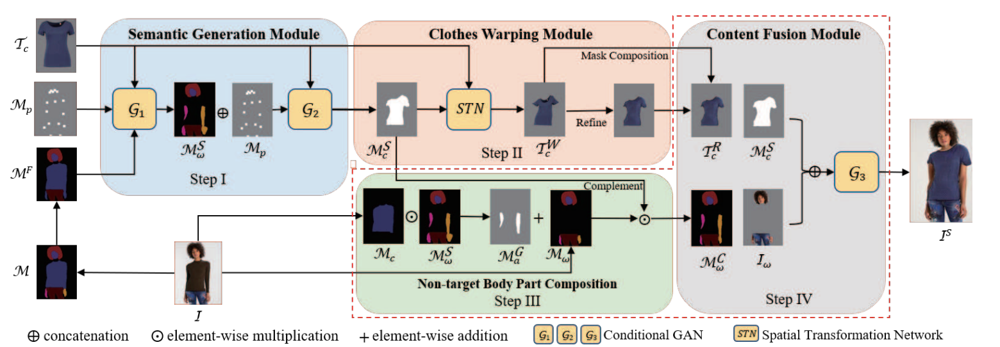
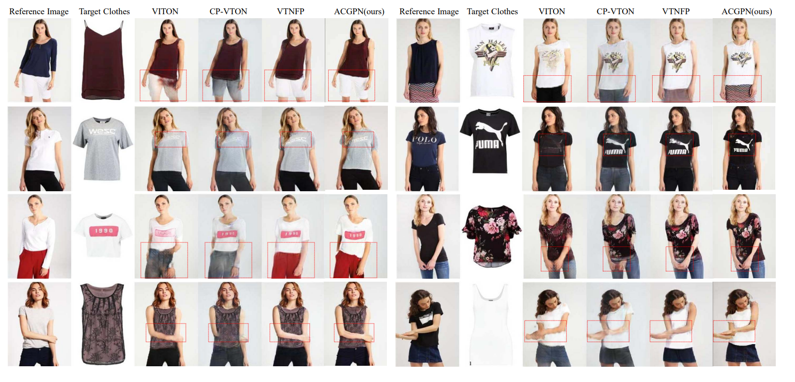

## **Adaptive Content Generating and Preserving Network (ACGPN)**

*Link paper: [here](https://openaccess.thecvf.com/content_CVPR_2020/papers/Yang_Towards_Photo-Realistic_Virtual_Try-On_by_Adaptively_Generating-Preserving_Image_Content_CVPR_2020_paper.pdf)*  
*Link repo: https://github.com/switchablenorms/DeepFashion_Try_On*

Kiến Trúc ACGPN gồm 3 module:
- Semantic layout generation Module: dự đoán các layouts của các phần trên cơ thể người sẽ bị thay đổi sau khi thay đồ
	+ Input: ảnh đồ cần mặc ($T_c$) & (kết quả của quá trình human parser ($M_f$) + detect keypoints ($M_p$)  trên ảnh dáng người có sẵn ($I$))
	+ Output: ảnh semantic các phần trên cơ thể người sau khi mặc $T_c$ ($M^S_{\omega}$) +  ảnh mask vật được tạo ra từ kiểu dáng của  $M_f$ và chứa nội dung (thô) của $T_c$ ($M^S_{\epsilon}$)
	+ Kiểu mô hình được sử dụng: 2 mô hình cGAN
- Clothes Warping Module: chuyển đổi dáng của đồ cần mặc sáng dáng đồ trong các layouts đã được dự đoán từ module semantic
	+ Input: $M^S_{\epsilon}$
	+ Output: ảnh đồ cần mặc ($T_c$) được chuyển đổi theo kiểu dáng người trong ảnh $I$ ($T^R_c$) 
	+ Kiểu mô hình được sử dụng: Spatial Transformation Network (STN) + Thin-Plate Spline (TPS)
- Content Fusion Module: tích hợp tất cả thông tin đã có (kiểu dảng chuyển đổi, màu sắc, độ tưởng phản, ...) để hoàn thiện việc mặc đồ trên dáng người đã có
	+ input: $T^R_c$, $M^S_{\epsilon}$
	+ Output: kết quả cuối cùng
	+ kiểu mô hình được sử dụng: GAN
	+ Quá trình: gồm 2 bước là **Non-target Body Part Composition** để xác định các bộ phận trên cơ thể bị thay dổi sau khi mặc đồ ($T_c$) và **Mask Inpainting** để điền kết quả của module thứ 2 lên ảnh để được kêt quả cuối cùng

### **Một số kết quả điển hình:**

Ưu điểm:
- Nội dung về màu sắc, độ tương phản của đồ cần mặc được giữ ở mức độ tốt với ảnh phân giải thấp
- Thành công trong việc chuyển đổi hình dáng đồ cần mặc	
Nhược điểm:
- Đồ cần mặc và độ đã có trên cơ trên người đôi khi phải cùng loại
- một số trường hợp context của vật cần mặc bị loang ra ngoài