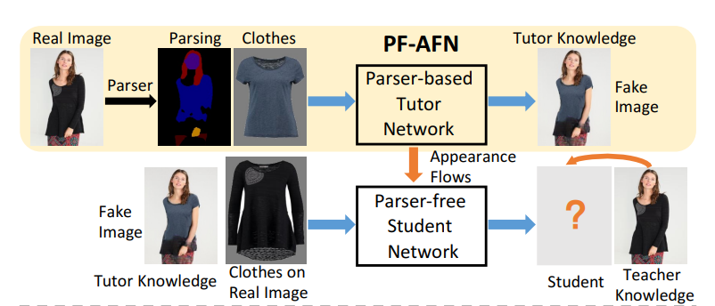
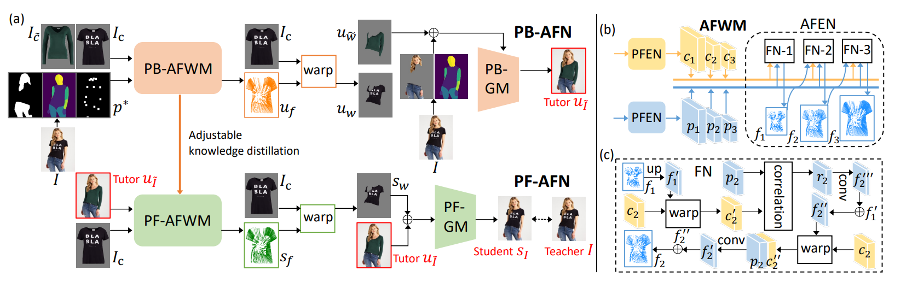
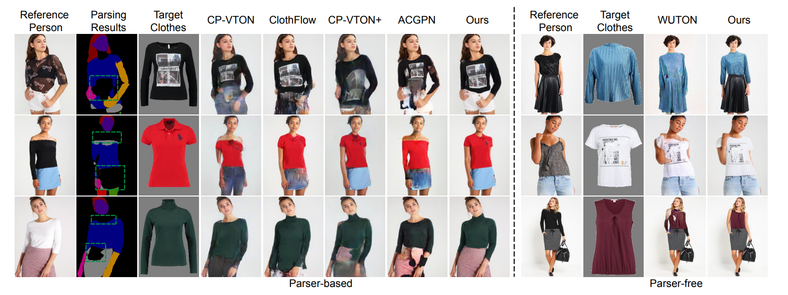
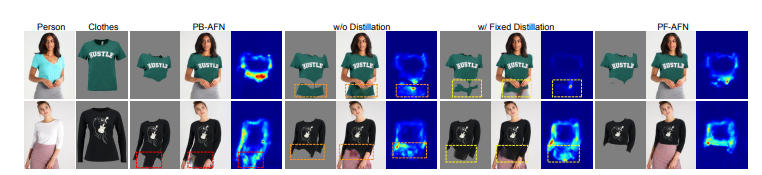

## **Parser Free Appearance Flow Network (PF-AFN)**
 

*Link paper: https://arxiv.org/pdf/2103.04559v2.pdf*  
*Link repo: https://github.com/geyuying/PF-AFN*    

### Chiến lược huấn luyện: “teacher-tutor-student”
- Loại bỏ human parser
- chuyển bài toán từ unsupervised learning thành selfsupervised learning
- Quy  trình: 
	+ Parsing ảnh gốc + ảnh vật target qua generation model (teacher) -> ảnh fake (unsupervised learning)
	+ ảnh fake + vật bị thay thế trong ảnh gốc quá generation model (student) -> so sánh với ảnh gốc để thu kết qua tốt nhất (supervised learning)

     

### Kiến trúc mô hình khi training (hình a)
- training teacher: teacher có kiến trúc tương đồng với các state-of-the-art model nhứ VITON, ACGPN, khác tại module warping: 
	+ **Appearance Flow Warping Module (AFWM)**(hình b):  sử dụng 2 luồng **Pyramid Feature Extraction Network (PFEN)**  để trích xuất đặc trưng ở các mức độ khác nhau
	+ Các đặc trưng sẽ được cho đi qua **Appearance Flow Estimation Network (AFEN)** chứa các Flow Networks (FN) để ước lượng Appearance Flow (FN là tập các vector biến đổi vật cần mặc)
	+ **Generative Module (GM)**: Res-UNet (Unet with Resnet backbone) 

     

### Một số kết quả điển hình
     

### Đánh giá thực nghiệm
- Trên tập dữ liệu VITON (256x192), VITON-HD (512x384)
- Cho kết quả tốt hơn VITON hay CP-VITON, ACGPN
- Đơn giản hóa dữ liệu đầu vào, giảm kích thước mô hình

     
