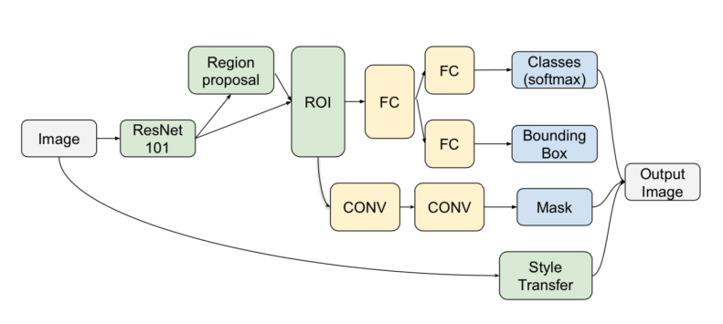
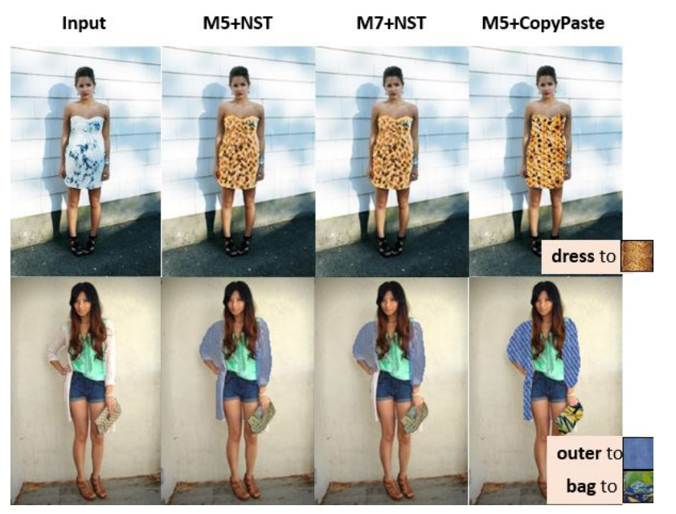
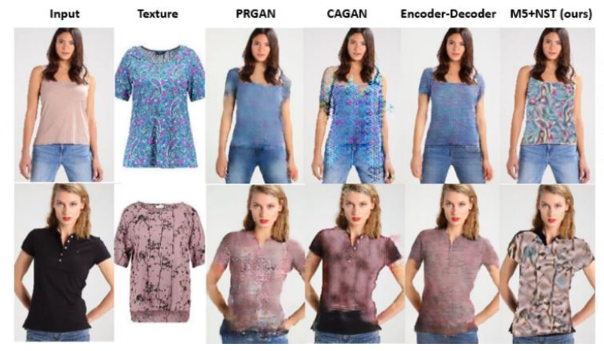

## **Image-based Virtual Fitting Room**
### 1. Method
- propose Mask-RCNN to leverage itself two stage and Neural Style Transfer (NST)  
- Mask-RCNN with Resnet-101-FPN (Feature Pyramid Network) as backbone predicts box, mask of items  
- NST to learn and tranform pose and context of target items to right position in original image  

#### 1.1. Mask-RCNN
- Regional Proposal Network (RPN)
  - Loss: MSE for confidence and IoU for Box
- Instant segmentation
  - Loss: MSE per class
#### 1.2. Neural Style Transfer (NST)
- Content Loss: measures how much the feature map of the generated image differs from the feature map of the source image 
- Style loss:  

## Results

