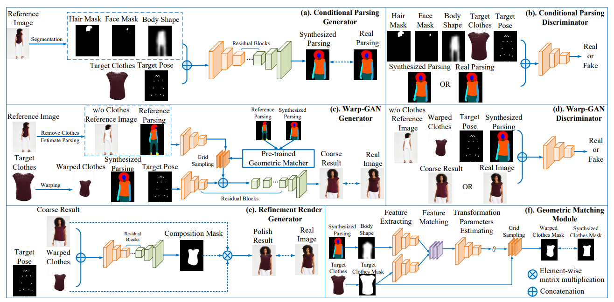
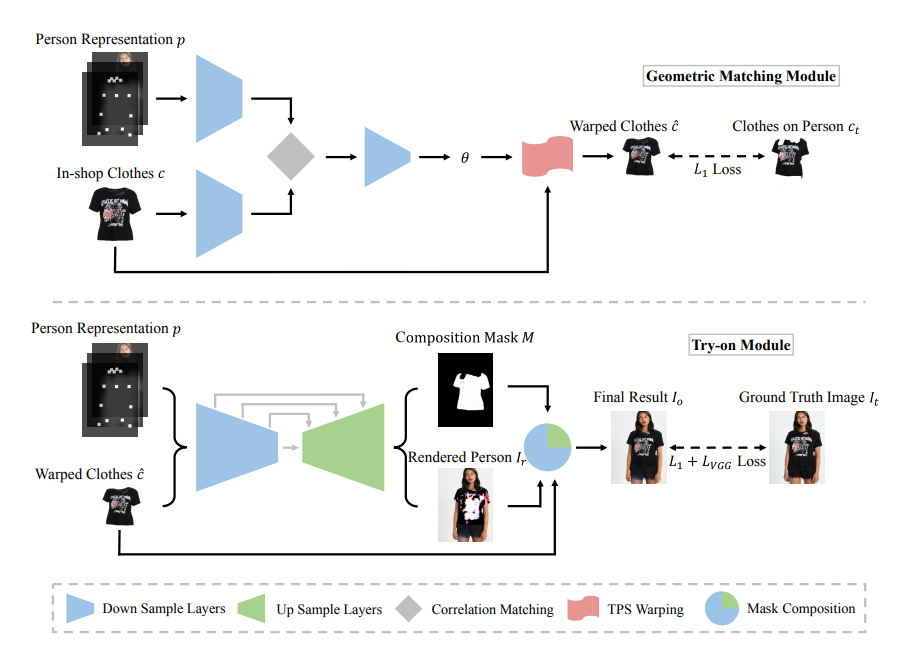
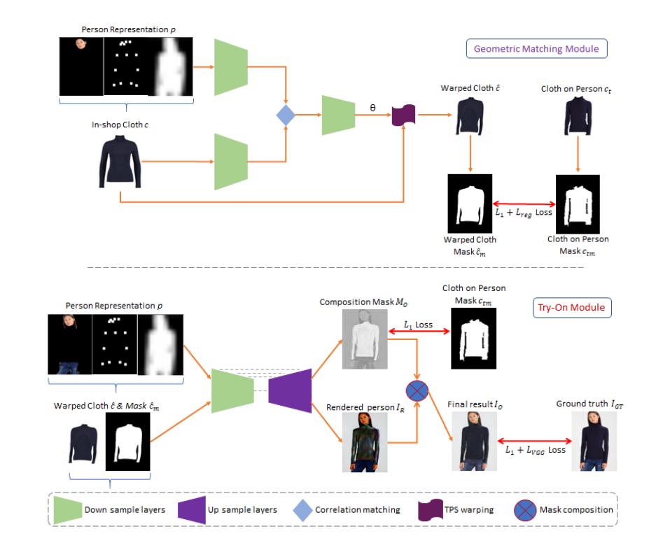
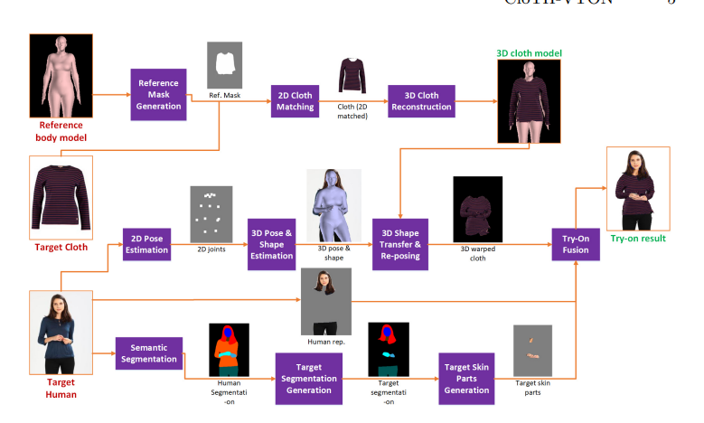
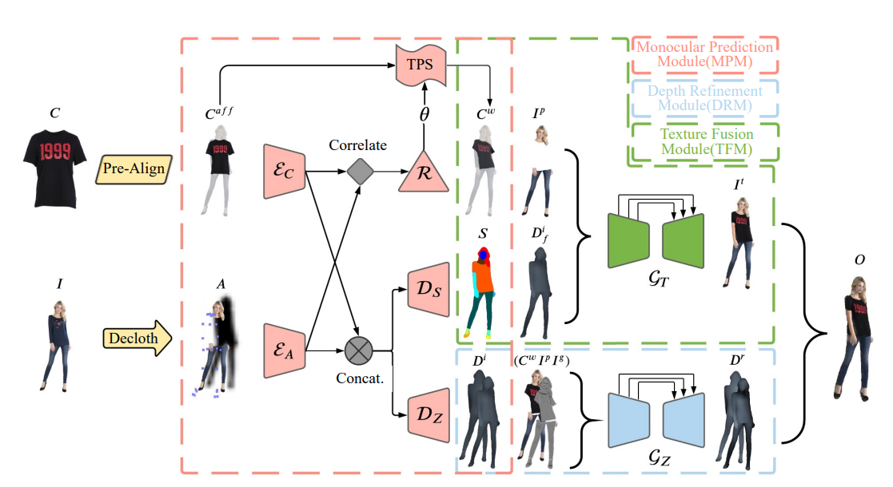

[MG-VITON: Multi pose for VITON](https://arxiv.org/pdf/1902.11026v1.pdf)  
    

[CP-VITON](https://arxiv.org/pdf/1807.07688.pdf) (preserve shape and context)  
Link code: [here](https://github.com/sergeywong/cp-vton)  
    

[CP-VITON+](https://minar09.github.io/cpvtonplus/cvprw20_cpvtonplus.pdf) (preserve shape and context more) 
    

[CloTHVTON](https://openaccess.thecvf.com/content/ACCV2020/papers/Minar_CloTH-VTON_Clothing_Three-dimensional_reconstruction_for_Hybrid_image-based_Virtual_Try-ON_ACCV_2020_paper.pdf) 
    

[CloTHVTON+](https://ieeexplore.ieee.org/stamp/stamp.jsp?tp=&arnumber=9354778)  

[M3D-VTON](https://arxiv.org/pdf/2108.05126.pdf) 
Link code: [here](https://github.com/fyviezhao/M3D-VTON) 
    