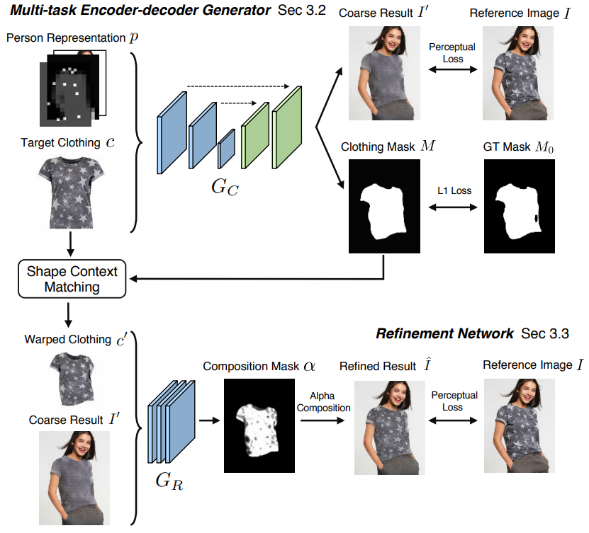
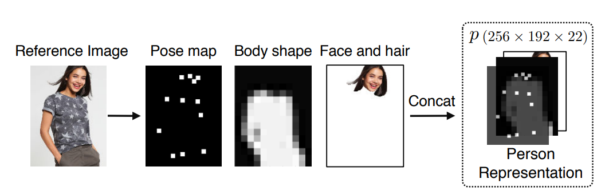
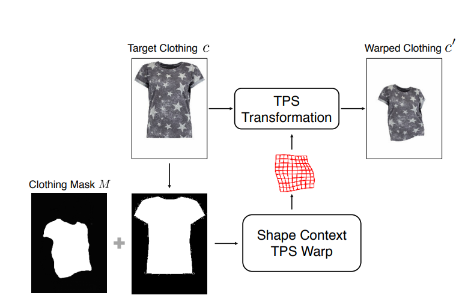
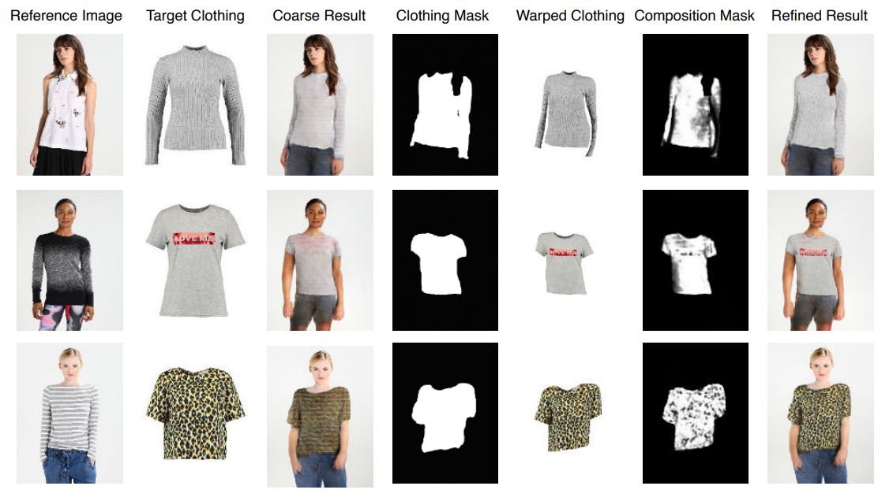
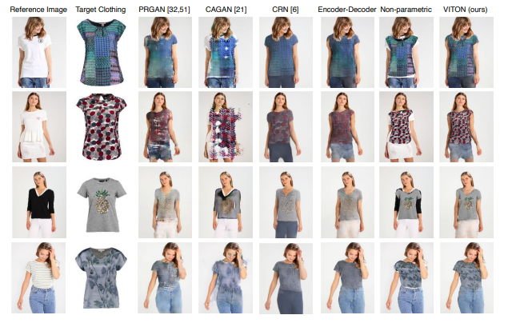

## **[VITON: An Image-based Virtual Try-on Network](https://arxiv.org/pdf/1711.08447.pdf)**
### 1. Problem description
- Input:  
  	A reference image I with a clothed person   
  	A target clothing item c.
- Output:
	Synthesis image that person wears clothing item c.
### 2. VITON
#### 2.1. Proposed method
- Learn a proper transformation from product images to clothes on the body  
- Leverage training data of a person with fixed pose wearing different clothes and the corresponding product images  

#### 2.2. Architecture

- GAN architecture with Unet is generator and VGG is dicriminator
- Inputs of Unet are person representations with 4 channels (original image, pose heatmap, Body shape, Face and hair) and target clothing (RGB). Outputs are coarse result that person in original image wear target clothing and clothing mask.
- Target clothing c is tranformed follow mask and match context. Then it feed into refined task to find composition and match to coarse result.

#### 2.2.1. Person Representation  
- Pose heatmap: detect 18 keypoints   
- Human body representation: compute segmentation map of body  
- Face and hair segment: segmentation map (to maintain identity identity)  

#### 2.2.2. Multi-task Encoder-Decoder Generator
- Backbone: Unet
- Loss function: perceptual loss (VGG19 network as discriminator) for synthesized image and L1 loss for mark of item
  
#### 2.2.3. Refinement Network
- Warped clothing item: propose TPS transformation to learn context of item c to transformed item (use siamese architecture).

### Results

